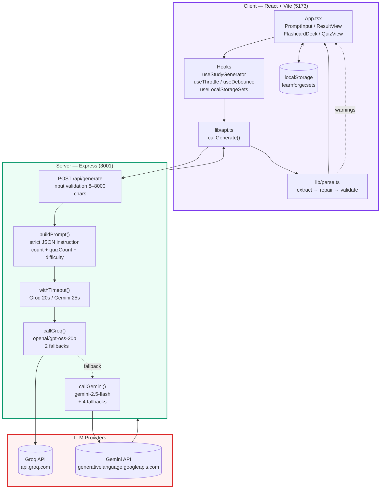
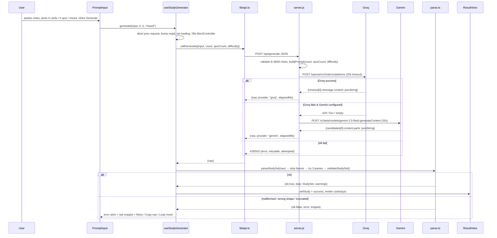
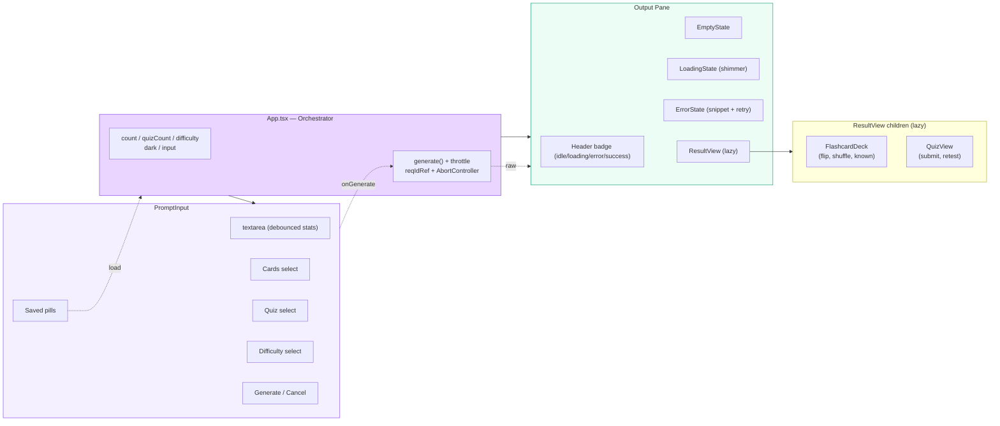
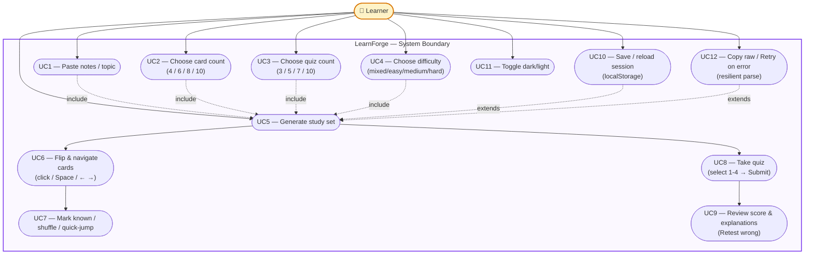
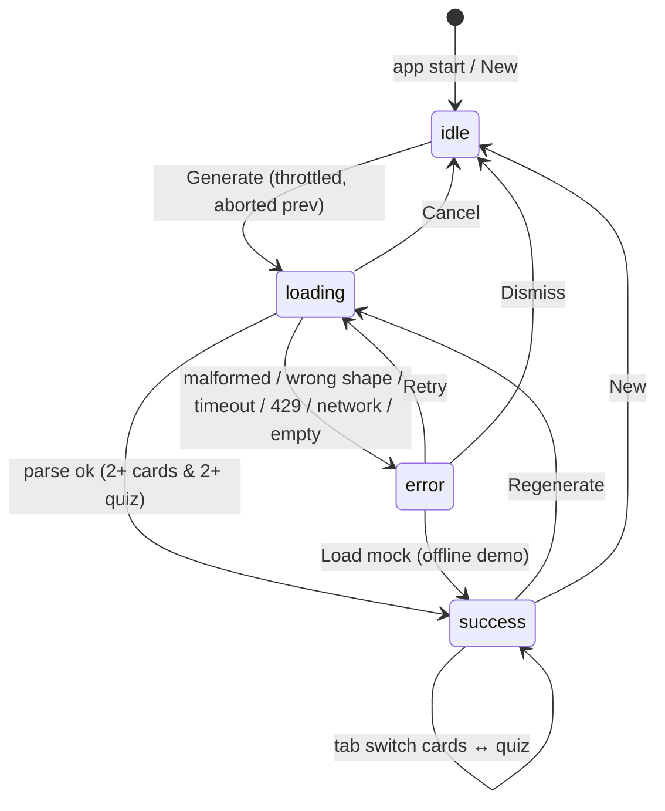

# LearnForge — AI Study Assistant

<p align="center">
  <strong>Turn any notes or topic into flashcards + quiz — structured JSON, not a chatbot.</strong><br/>
  <em>Frontend Internship Assignment · Study Assistant track · Production-ready parse pipeline</em>
</p>

<p align="center">
  
  
  
  
  
  
</p>

---

## 🎬 Demo Video

> **Click the thumbnail to watch the 60–90s walkthrough on Google Drive** (no large file committed to the repo to keep the deployment light).

[](https://drive.google.com/file/d/YOUR_DRIVE_FILE_ID/view?usp=sharing)

**Direct link:** `https://drive.google.com/file/d/YOUR_DRIVE_FILE_ID/view?usp=sharing`

> Replace `YOUR_DRIVE_FILE_ID` with your Drive file ID. Make sharing `Anyone with the link → Viewer` before submission. The thumbnail above is a Drive badge — clicking it opens the Drive player; you can also replace the badge with a custom YouTube-style thumbnail if you prefer:
> ```md
> [](https://drive.google.com/file/d/YOUR_DRIVE_FILE_ID/view?usp=sharing)
> ```

**What’s inside (60–90s):** paste messy notes → pick card count + quiz count + difficulty → Generate → flip cards with Space / ← → → switch to Quiz → answer → Submit → explainers → Retest wrong → show Saved sessions → show error path (empty / offline).

---

## ⚡ TL;DR — Run it in 30 seconds

```bash
git clone <your-fork> && cd learn-forge
npm install
cp .env.example .env   # add GROQ_API_KEY and/or GEMINI_API_KEY
npm run dev            # ← single command: Vite (5173) + Express API (3001) concurrently
# open http://localhost:5173
```

| Command | What it does |
|---|---|
| `npm run dev` | **Frontend + API together** (Vite + `node server.js` via `concurrently`) — _the one you need_ |
| `npm run dev:client` | Vite only |
| `npm run dev:server` | Express API only |
| `npm run dev:all` | Alias for `dev` (backwards-compat) |
| `npm run build && npm start` | Production — `dist/` served by Express on `PORT` |
| `npm run preview` | Vite preview (frontend only) |
| `npm run lint` | ESLint |

> **Why `npm run dev` is enough:** `vite.config.ts:13` proxies `/api → http://localhost:3001` in dev, and `package.json:7` runs both processes with one command. No two terminals needed.

---

## 📑 Table of Contents

- [Demo Video](#-demo-video)
- [Overview](#-overview)
- [Features](#-features)
- [Tech Stack](#-tech-stack)
- [Architecture & System Design](#-architecture--system-design)
- [Project Structure](#-project-structure)
- [Setup & Environment](#-setup--environment)
- [Usage Guide](#-usage-guide)
- [API Contract](#-api-contract)
- [Resilience — Taming Bad AI Output](#-resilience--taming-bad-ai-output)
- [Performance & Optimizations](#-performance--optimizations)
- [UI / UX Notes](#-ui--ux-notes)
- [Deployment](#-deployment)
- [Known Limitations & Roadmap](#️-known-limitations--roadmap)
- [AI-usage Note](#-ai-usage-note-honest)
- [Time Spent](#️-time-spent)
- [Troubleshooting](#-troubleshooting)
- [Scripts Reference](#-scripts-reference)

---

## 🧭 Overview

**LearnForge** is the *Study Assistant* track submission. Unlike chat UIs that stream markdown, this app **demands structured JSON** from the LLM:

```
User pastes free-form notes → POST /api/generate { input, count, quizCount, difficulty }
  → server builds strict prompt (responseMimeType: application/json)
  → Groq (primary) → fallback Gemini → { raw: jsonString }
  → client parse → validate → render flashcards / quiz
```

Raw model text is **never rendered**. If JSON is malformed or the shape is wrong, we repair, validate, and show a friendly error with a snippet — never crash.

**Chosen track rationale:** fridge-to-recipe and trip-planner share the same requirement. Study assistant was picked because it has the *clearest schema* (`topic, summary, flashcards[], quiz[]`), making validation, wrong-shape detection, and UI states most demonstrable for interview discussion.

---

## ✨ Features

- **Cards + Quiz, both configurable:** choose `4 / 6 / 8 / 10` cards and `3 / 5 / 7 / 10` quiz questions + `mixed / easy / medium / hard` difficulty — all respected by the prompt (`server.js:44`).
- **Flashcards:** 3D flip (click / Space), ← / → navigate, Mark known, deterministic shuffle, progress dots, mini-list quick-jump.
- **Quiz:** 4-option MCQ, select → Submit → score + per-question explanation, **Retest wrong** loop, progress bar, keyboard 1-4.
- **No-chat guarantee:** `src/lib/parse.ts` is the only gate — every failure path returns a typed `ParseResult`.
- **Persistence:** saved sessions in `localStorage` (`learnforge:sets`, max 12), reload by topic pill.
- **Resilience:** timeouts, retries via fallback models, abort + stale-guard, truncation detection.
- **Polish:** dark/light (`prefers-color-scheme` + toggle), mobile single-column, 44px targets, focus rings, shimmer skeleton, elapsed-ms badge, char/word count, debounce, throttle.

---

## 🧰 Tech Stack

| Layer | Choice | Why |
|---|---|---|
| **Frontend** | React 19 + TypeScript + Vite | Fast HMR, strong typing for `StudySet`, modern `defineConfig` |
| **Styling** | Tailwind CSS 4 + CSS variables | Theme tokens (`--accent`, `--bg`), dark mode via `.dark` class |
| **Backend** | Express 5 + `dotenv` + `cors` | Minimal proxy that keeps `GROQ_API_KEY` / `GEMINI_API_KEY` server-only |
| **LLM** | Groq (`openai/gpt-oss-20b` + fallbacks) → Gemini (`gemini-2.5-flash` + fallbacks) | Groq = fast/low-502, Gemini = `responseMimeType: application/json` fallback chain |
| **Parsers** | `src/lib/parse.ts` (extract → repair → validate) | 3-attempt parse, truncation guard, shape warnings |
| **State** | Hooks (`useStudyGenerator`, `useLocalStorageSets`, `useDebounce`, `useThrottle`) | Isolated concerns, abort + stale-race guard (`reqIdRef`) |
| **Build** | `tsc -b` + Vite, `concurrently` for dev | `dist/` served by Express in prod (`/*splat` for SPA) |

---

## 🏗️ Architecture & System Design

### 1. High-Level Architecture



**Principles applied**

| Principle | How |
|---|---|
| **Layered architecture** | `UI → Hooks → lib/api → Express → LLM` — each layer owns one concern |
| **Proxy pattern** | Browser never holds LLM keys; Vite proxies `/api` in dev, Express serves `dist` in prod |
| **Failover / Chain of responsibility** | Groq primary → Gemini fallback; each provider has its own fallback model list |
| **Separation of concerns** | `parse.ts` owns all JSON tolerance, `useStudyGenerator` owns orchestration + cancellation |
| **Offline-first UX** | `mock.ts` deterministic deck + `localStorage` so UI is demo-able without API keys |

### 2. Request Sequence



### 3. Component Diagram



### 4. Use-Case Diagram



### 5. State Machine — Generation Lifecycle



---

## 📁 Project Structure

```
learn-forge/
├── server.js                 # Express proxy — prompt, timeout, Groq→Gemini fallback
├── vite.config.ts            # /api proxy → :3001 (dev) + React + Tailwind + Babel
├── index.html
├── .env.example              # GROQ_API_KEY / GEMINI_API_KEY / PORT
├── public/
│   └── favicon.svg           # (no video committed — see Demo Video Drive link)
└── src/
    ├── App.tsx               # state (input, count, quizCount, difficulty, dark), throttle, layout
    ├── types.ts              # StudySet / Flashcard / QuizQuestion / ParseResult
    ├── main.tsx
    ├── index.css             # CSS variables, dark tokens, animations
    ├── lib/
    │   ├── api.ts            # callGenerate() — transport only, never LLM directly
    │   ├── parse.ts          # extract → repair → validate (the 20% that matters)
    │   └── mock.ts           # deterministic demo deck (no AI)
    ├── hooks/
    │   ├── useStudyGenerator.ts  # generate(), abort, stale-guard, 28s timeout
    │   ├── useLocalStorageSets.ts
    │   ├── useDebounce.ts
    │   └── useThrottle.ts
    └── components/
        ├── Header.tsx
        ├── PromptInput.tsx   # textarea + cards/quiz/difficulty + examples + saved
        ├── ResultView.tsx    # topic/summary + tabs (lazy) + Save/Regenerate
        ├── FlashcardDeck.tsx # 3D flip, shuffle, known, quick-jump
        ├── QuizView.tsx      # MCQ, submit, score, retest-wrong
        ├── LoadingState.tsx
        ├── ErrorState.tsx
        └── EmptyState.tsx
```

---

## 🔧 Setup & Environment

### Prereqs

- **Node 18+** (fetch is native; no polyfill)
- A Groq or Gemini API key (at least one):
  - Groq (primary, fast): https://console.groq.com/keys
  - Gemini (fallback, `responseMimeType: application/json`): https://aistudio.google.com/api-keys

### 1. Install

```bash
npm install
```

### 2. Env

```bash
cp .env.example .env
# edit .env:

# Primary — fast, low 502
GROQ_API_KEY=gsk_...
GROQ_MODEL=openai/gpt-oss-20b   # falls back to openai/gpt-oss-120b, qwen/qwen3.8-27b

# Fallback — strict JSON
GEMINI_API_KEY=AIza...
GEMINI_MODEL=gemini-2.5-flash   # falls back to gemini-flash-latest, gemini-2.5-flash-lite, …

PORT=3001
```

> The keys are **server-only** (`server.js` reads `process.env.*`). They are never bundled or sent to the browser — all LLM calls are `POST /api/generate`.

### 3. Run — one command

```bash
npm run dev
# Vite on http://localhost:5173  (proxies /api → http://localhost:3001)
# API  on http://localhost:3001  (also logs provider → fallback chain)
```

Or run separately: `npm run dev:client` · `npm run dev:server` · `npm run dev:all` (alias).

### 4. Production

```bash
npm run build
npm start            # serves dist/ + API on $PORT — single process (ideal for Render/Vercel/Netlify)
# or: npm install && npm start  (after build, no extra steps)
```

`server.js` serves `dist/index.html` for all routes (`/*splat`, Express 5) — client-side routing works.

### 5. Verify

```bash
curl http://localhost:3001/api/health
# { ok, hasGroqKey, hasGeminiKey, hasKey, groqModel, geminiModel, fallbackModels, time }

# quick generate (needs key)
curl -X POST http://localhost:3001/api/generate \
  -H 'Content-Type: application/json' \
  -d '{"input":"Explain photosynthesis for 10th grade","count":6,"quizCount":5,"difficulty":"mixed"}'
```

Without a key, `POST /api/generate` returns `500` with a friendly message — the UI surfaces it without crashing.

---

## 📖 Usage Guide

### Step-by-step

1. **Paste material** in the left pane — raw lecture notes, messy bullets, or a single topic like `Explain quantum entanglement for a 10th grader`. Char/word count updates debounced (250ms).
2. **Pick counts:**
   - **Cards:** `4 — quick` · `6 — balanced` · `8 — deep` · `10 — exam`
   - **Quiz:** `3 — quick` · `5 — balanced` · `7 — deep` · `10 — exam`
   - These are **prompt-contracts** — `buildPrompt()` requests exactly that many, and `validateStudySet()` enforces `≥2` valid items or fails with guidance.
3. **Pick difficulty:** `Mixed — adaptive` · `Easy — recall` · `Medium — apply` · `Hard — challenge` → injected as `Difficulty: ${difficulty}` in the prompt.
4. Click **Generate study set • 6c / 5q** (or `⌘+Enter`). Rapid double-clicks are throttled (1s window, `useThrottle:30`). Previous in-flight request is aborted.
5. **Study:**
   - **Cards tab:** click or press `Space` to flip, `←` / `→` to navigate, `☆ Mark known`, `⇄ Shuffle` (deterministic by `topic.length`, not random), progress dots, **Quick jump** list.
   - **Quiz tab:** pick one per question (`1-4` keys), progress bar, **Submit** (requires all answered), score badge (`≥70%` green, `≥40%` amber), per-question `✓/✕` + `explanation`, **Retest wrong** loop.
6. **Save** the session → pill appears under *Saved sessions*; click to reload. Stored in `localStorage` (`learnforge:sets`), max 12, survives reload.

### Try quickly

- **Load sample** → fills with React Hooks notes.
- **Example pills:** Photosynthesis / React Hooks / World War II / ML notes — one tap to fill textarea.
- **Offline demo:** if the provider is rate-limited, `ErrorState` offers **Load mock** → deterministic deck from `mock.ts` respecting your chosen `count`/`quizCount`.

### Keyboard

| Context | Keys |
|---|---|
| **Cards** | `←` / `→` navigate (120ms flip-delay), `Space` / `Enter` flip, `Tab` to focus, `☆` button |
| **Quiz** | `Tab` + `1-4` select, `Submit` needs all answered |
| **Global** | `⌘/Ctrl + Enter` generate (when textarea focused) |

---

## 🔌 API Contract

### `GET /api/health`

```json
{
  "ok": true,
  "hasGroqKey": true,
  "hasGeminiKey": true,
  "hasKey": true,
  "groqModel": "openai/gpt-oss-20b",
  "geminiModel": "gemini-2.5-flash",
  "fallbackModels": {
    "groq": ["openai/gpt-oss-20b","openai/gpt-oss-120b","qwen/qwen3.8-27b"],
    "gemini": ["gemini-2.5-flash","gemini-flash-latest","gemini-2.5-flash-lite","gemini-2.5-pro"]
  },
  "time": "2026-..."
}
```

### `POST /api/generate`

**Request**

```json
{
  "input": "string — 8..8000 chars (required)",
  "count": 6,          // optional — cards, 3..10, default 6, clamped
  "quizCount": 5,      // optional — quiz questions, 3..10, default 5, clamped (also accepts quiz_count)
  "difficulty": "mixed" // optional — mixed|easy|medium|hard, default mixed
}
```

**Success (`200`)**

```json
{
  "raw": "{\"topic\":\"...\",\"summary\":\"...\",\"flashcards\":[...],\"quiz\":[...]}",
  "model": "groq:openai/gpt-oss-20b",
  "provider": "groq",
  "attempted": [{"model":"groq:openai/gpt-oss-20b","status":200}],
  "elapsedMs": 1843
}
```

The client then does `parseStudySet(raw)` — server never trusts model output; validation is client-side.

**Errors**

| Status | When | Body |
|---|---|---|
| `400` | input missing / `<8` / `>8000` | `{error}` |
| `500` | no key configured / invalid key (`401/403`) | `{error, retryable:false, attempted}` |
| `429` | rate-limited | `{error:"Rate limited — wait ~30s...", retryable:true}` |
| `502` | provider 5xx / model not found after fallbacks / empty response | `{error, retryable, attempted, blockReason}` |
| `504` | timeout (25s server, 28s client AbortController) | `{error, timeout:true}` |

Input validation happens **before** any LLM call — fast fail, no wasted tokens.

---

## 🛡️ Resilience — Taming Bad AI Output

> This is the 20% that decides if the app feels production or demo.

| Failure | How it surfaces | What we do | Where |
|---|---|---|---|
| **Malformed JSON** (trailing commas, code fences, smart quotes, single quotes, comments, preamble) | `SyntaxError` | `stripCodeFences` → `extractJsonObject` → `tryAutoFix` → 3 parse attempts; on fail show “Malformed JSON” + first 800 chars + Copy raw + Retry | `src/lib/parse.ts:4` / `src/lib/parse.ts:33` |
| **Wrong shape** (missing keys, empty strings, `options≠4`, `answer∉0..3`, too few items) | Valid JSON but schema mismatch | `validateStudySet()` returns `{ok:false, error:"Wrong shape: ..."}`; we show error + formatted snippet; `<2` cards/q fails, warnings allow usable sets | `src/lib/parse.ts:68` |
| **Empty / blocked** | `candidates[0].content.parts` empty or Groq empty `content` | Server `502` with `blockReason`/`safetyRatings`, client shows “empty response (reason: …) — try rephrasing” | `server.js:318` / `src/hooks/useStudyGenerator.ts:54` |
| **Truncated** | Unbalanced `{}` or no closing `]` `}` | `isLikelyTruncated()` → yellow banner “Response looks truncated — retry” | `src/lib/parse.ts:179` |
| **Slow** | >20–25s | Server `withTimeout(20s Groq, 25s Gemini)` → `504`; client `AbortController` 28s → “Request timed out — retry”, shows **Cancel** | `server.js:80` / `src/hooks/useStudyGenerator.ts:43` |
| **Rate / 5xx** | `fetch` non-2xx | Server maps `429→429`, `401/403→500 "Invalid key"`, else `502`; client maps `Failed to fetch` → “Is the server running? `npm run dev`” | `server.js:289` / `src/hooks/useStudyGenerator.ts:82` |
| **Stale race** | User hits Generate twice quickly | `reqIdRef` increment + `abortRef`; every `await` checks `myId !== reqIdRef.current` before `setState` | `src/hooks/useStudyGenerator.ts:18` |
| **Never crashes** | Any of above | All `try/catch`, `res.json().catch(()=>({}))`, guards on `candidate?.content?.parts` | throughout |

**Explicit states (no blank screens):**

- **Loading:** skeleton shimmer + spinner + “older requests auto-cancelled” + **Cancel**.
- **Error:** `role="alert"` card with error text, raw `<pre>` snippet, **Retry** / **Copy raw** / **Dismiss**, plus `<details>` explaining repair steps + **Load mock** fallback.
- **Empty:** illustration + “Ready when you are” + example pills + keyboard hint.
- **Warnings (non-blocking):** yellow banner when some cards/q were skipped but overall set is usable.

---

## ⚡ Performance & Optimizations

| Technique | File | Effect |
|---|---|---|
| **Code splitting + lazy** | `App.tsx:12`, `ResultView.tsx:5` | `ResultView`, `FlashcardDeck`, `QuizView` are separate chunks (`vite build` shows `ResultView-*.js`, `FlashcardDeck-*.js`, `QuizView-*.js`) |
| **Debounce** | `PromptInput.tsx:42`, `hooks/useDebounce.ts` | 250ms debounce for char/word stats — avoids recomputing on every keystroke |
| **Throttle** | `App.tsx:30`, `hooks/useThrottle.ts` | 1000ms throttle on Generate — prevents double-submit spam even before `AbortController` |
| **Abort + stale guard** | `hooks/useStudyGenerator.ts:18` | `AbortController` cancels previous fetch; `reqIdRef` ignores late responses |
| **Deterministic shuffle** | `FlashcardDeck.tsx:16` | LCG seeded by `topic.length*31` — same topic → same shuffle, no `Math.random` flakiness |
| **Response caching** | `useLocalStorageSets.ts` | 12-slot `localStorage` LRU — instant reload, no re-generation |
| **Timeout budgets** | `server.js:118`, `useStudyGenerator.ts:43` | Server 20s/25s, client 28s — fails fast instead of hanging |
| **Vite proxy** | `vite.config.ts:13` | No CORS in dev, no extra deployment proxy to configure |

Bundle (prod, gzipped): `index-*.js ~85 kB`, CSS `~9.5 kB`, lazy chunks `2–3 kB` each — fast on 3G.

---

## 🎨 UI / UX Notes

- **Responsive:** single-column `<980px` (`@media`), textarea resizes vertically, cards `220px` on mobile, header collapses, 3-way select grid stacks.
- **Dark mode:** `prefers-color-scheme` + manual toggle (`.dark` class + CSS variables, `color-scheme` sync, no FOUC).
- **A11y:** `role="tablist"` / `aria-selected`, `aria-label` on cards, `role="alert"` on errors, visible focus rings (`:focus-visible`), 44px touch targets, reduced-motion respected.
- **Animation:** `preserve-3d` flip (`rotateY(180deg)` 500ms cubic), shimmer skeleton, button lift on hover — all gated by `prefers-reduced-motion`.
- **Polish:** `localStorage` saves, elapsed `ms` badge, char/word count, example pills, deterministic identifiers — all interview-talkable.

---

## 🚀 Deployment

### One-service deploy (recommended)

`server.js` already serves `dist/` in production — **one process** handles SPA + API.

```bash
npm run build
# PORT is respected (Render/Vercel serverless/Netlify functions need adapter)
npm start
```

- **Render:** `Build: npm install && npm run build` · `Start: npm start` · set `GROQ_API_KEY` + `GEMINI_API_KEY` in env.
- **Vercel:** works as Node server (add `vercel.json` rewrite for SPA if not using server), or split: frontend on Vercel + server on Render (update `vite.config.ts` proxy / `lib/api.ts` base URL).
- **Netlify:** `netlify.toml` `publish = dist`, `functions` for `/api/generate` or single-node via `netlify-plugin-inline-functions`.

Add the deployed URL to the top of this README and to your video captions.

---

## ⚠️ Known Limitations & Roadmap

| Now | Next |
|---|---|
| **No streaming** — we buffer `raw` for simpler repair | Stream via `streamGenerateContent` + incremental JSON patch (e.g. `jsonrepair` + partial parse) |
| **No refine loop** — edit input → Regenerate | `POST /api/refine { studySet, instruction }` + merge diff |
| **No backend DB** — `localStorage` only (~12 sets, cleared on wipe) | Add SQLite/Postgres + auth (e.g. `better-auth`), `GET /api/sets` |
| **Prompt brittleness** on small/free models | Add JSON schema (`response_schema`) + server-side re-ask once on shape fail |
| **No Vitest** — manual smoke via `npm run build` + `curl /api/health` + `parse.ts` asserts | Add `Vitest` for `parseStudySet` + `MSW` for `/api/generate` + Playwright E2E |
| **No ARIA live region** for quiz score | Add `aria-live="polite"` announcer |

---

## 🤖 AI-usage note (honest)

- **Used for:** initial scaffolding of Express proxy and `parse.ts` regex/helpers was drafted with an AI assistant (Muse Spark), then manually reviewed and tightened (added single-quote fallback, truncation check, stale-guard, quizCount). UI layout and `index.css` tokens were iterated with AI suggestions, but all logic was inspected and editable.
- **Not used for:** blind copy-paste — every function in `src/lib/parse.ts` and `server.js` is interview-ready to explain (e.g. *why 3 parse attempts*, *why `reqIdRef` after `await res.json()`*, *why `responseMimeType: application/json`*).
- **No existing repo submitted** — built from `npm create vite@latest` for this assignment.

---

## ⏱️ Time Spent

> Total: **~9–10 hours** (within assignment cap, across 2 iterations)

| Phase | Hours | What was done |
|---|---|---|
| **Scoping & track choice** | 0.5h | Compared fridge-to-recipe vs trip-planner vs study-assistant; chose study assistant for clearest JSON schema and best demo of structured-output validation |
| **Backend proxy** | 1.5h | Express `POST /api/generate`, `buildPrompt()` with `count` + `quizCount` + `difficulty`, Groq primary (20s) → Gemini fallback (25s) with 3+4 fallback models, `withTimeout`, `/api/health`, `responseMimeType: application/json`, `.env` + Vite proxy |
| **Resilient parsing** | 2.0h | `lib/parse.ts` — `stripCodeFences` → `extractJsonObject` → `tryAutoFix` → 3 parse attempts (raw, repaired, single→double quotes), `validateStudySet` (trim, slice, ≥2 cards & ≥2 quiz, de-dupe, warnings), `isLikelyTruncated` |
| **Frontend core & state** | 2.5h | `App.tsx` orchestration, `useStudyGenerator` (`reqIdRef` + `AbortController` 28s, stale-guard), `useThrottle`/`useDebounce`, `PromptInput` (cards 4/6/8/10 + quiz 3/5/7/10), `ResultView` tabs, `FlashcardDeck` (3D flip, shuffle, known), `QuizView` (submit, retest-wrong) |
| **Polish & systems** | 1.0h | `localStorage` saves (12 max), dark/light, mobile responsive, keyboard (←→/Space/1-4), `concurrently` single `npm run dev`, lazy chunks |
| **README & diagrams** | 1.5h | Architecture (Mermaid high-level + sequence + component + use-case + state-machine), system design table, API docs, troubleshooting, demo video slot, AI-usage note, known limitations |

**If more time:** streaming (`streamGenerateContent` + incremental patch), `POST /api/refine` loop, Vitest + MSW + Playwright, server-side truncation re-ask, deploy to Render/Vercel and attach final recording.

---

## 🧯 Troubleshooting

| Symptom | Cause | Fix |
|---|---|---|
| `Network error — please check ...` | API not running | Ensure `npm run dev` shows `[server] listening on ...`; check `curl /api/health` |
| `500 Invalid Groq/Gemini key` | Key missing / short | `cat .env` length `<20` triggers warn — rotate key, restart server |
| `429 Rate limited` | Free tier quota | Wait 30s and retry; add *both* keys so fallback can trigger |
| `502 Service temporarily unavailable` | Provider 5xx | Retry — Groq primary is less 502-prone; Gemini fallback auto-tries 3 models |
| `Malformed JSON` | Model added preamble/fences | Already auto-repaired — click **Retry**; if persistent, try shorter input or different `difficulty` |
| `Response looks truncated` | `maxOutputTokens` hit | Reduce `count`/`quizCount` (e.g. `4/3`) or shorten input |
| `Failed to fetch` in browser console | Wrong port | `vite.config.ts` proxy must match `PORT` in `.env` (default 3001) |
| `dist/ not found` in prod | Forgot build | Run `npm run build` before `npm start` — `server.js:356` logs this |

---

## 📜 Scripts Reference

| Script | Command | When to use |
|---|---|---|
| `dev` | `concurrently "vite" "node server.js"` | **Daily dev — one terminal** |
| `dev:client` | `vite` | Frontend-only debug |
| `dev:server` | `node server.js` | API-only debug / `curl` tests |
| `dev:all` | `concurrently "vite" "node server.js"` | Alias for `dev` |
| `build` | `tsc -b && vite build` | Before `start` / deploy |
| `start` | `node server.js` | Prod — serves `dist/` + API |
| `preview` | `vite preview` | Preview `dist/` without API |
| `lint` | `eslint .` | CI |

---

## 📄 License

MIT — assignment submission.

> **Setup recap:** `npm install` → `cp .env.example .env` → set `GROQ_API_KEY` or `GEMINI_API_KEY` → `npm run dev` → open `http://localhost:5173` → paste notes → pick **Cards** + **Quiz** counts + difficulty → **Generate** → study. Don’t forget to update the Demo Video Drive link at the top with your `YOUR_DRIVE_FILE_ID`!
